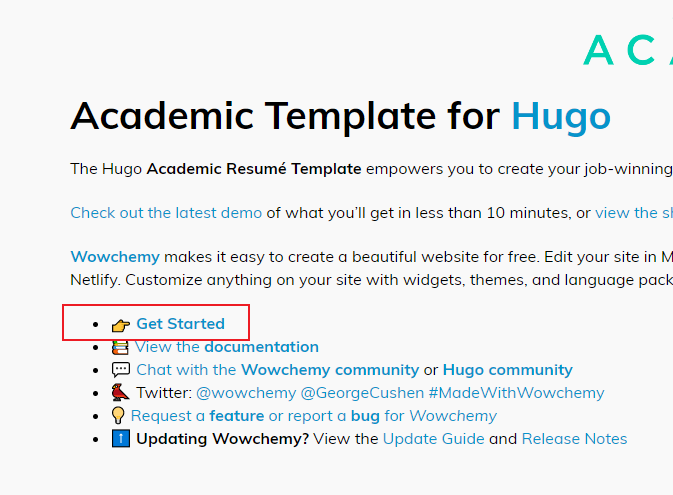
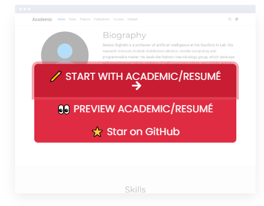
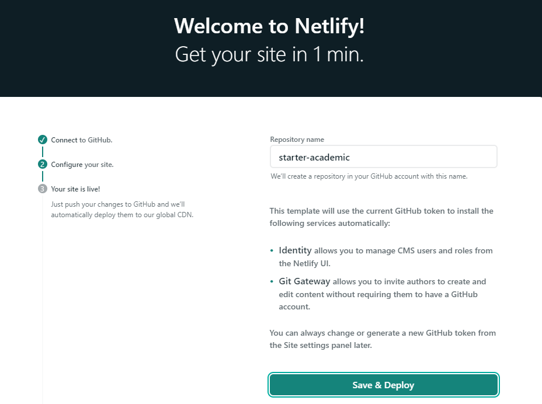
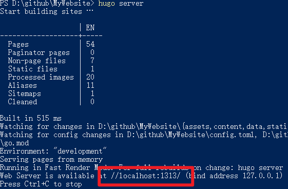
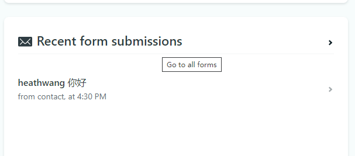
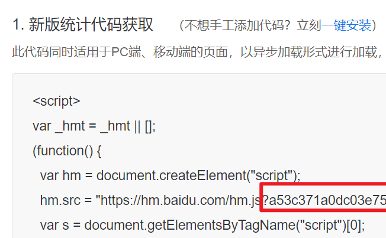
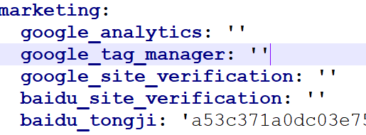

<script async src="//busuanzi.ibruce.info/busuanzi/2.3/busuanzi.pure.mini.js"></script>
<span id="busuanzi_container_site_pv" style="color:#829fbc;font-size:14px">本站总访问量 :eyes:<span id="busuanzi_value_site_pv"></span>次</span>




 

## 开始

1. 进入[官网](https://themes.gohugo.io/academic/)

2. 点击页面中的Get Started进入模板选择界面。



3. 选择好一个模板之后点击模板上的Start With Academic



4. 连接上自己的Github之后，设置一个库的名字，网站就会部署到这个库里。

   


{} 

网站更新到Github之后，Netlify会重新部署，可以在[Netlify网站](https://app.netlify.com/)上查看部署日志信息，如果部署出错也会有提示。

 {}

## 本地查看

将Github上的网站Clone到本地之后，可以在本地离线进行网页浏览。

### 查看方法

1. 本地安装Hugo，[点我查看如何安装？](https://gohugo.io/getting-started/installing/)

2. 进入网站文件夹，在命令行中使用如下命令，即可出现本地访问链接。

   ```cmd
   hugo server
   ```

   

## 编写文章

使用如下命令，创建一篇博客。

```cmd
 hugo new --kind post post/Hugo搭建个人网站
```

会自动在content/post 文件夹中生成一个md文件，使用Markdown编辑器进行文章编辑即可。

## 网站评论的查看

进入[Netlify网站](https://app.netlify.com/)的个人网页管理界面，在Recent form submissions管理模块中。




## 添加浏览次数

使用[不蒜子](https://busuanzi.ibruce.info/)

直接将下面的html代码写入markdown中。

```html
<script async src="//busuanzi.ibruce.info/busuanzi/2.3/busuanzi.pure.mini.js"></script>
<span id="busuanzi_container_site_pv">本站总访问量<span id="busuanzi_value_site_pv"></span>次</span>
```

## 添加百度统计

​		对访问量进行跟踪，该模板内嵌了对[百度统计](https://tongji.baidu.com/)的支持。

​		编辑`\MyWebsite\config\_default\params.yaml`中的baidu_tongji字段，将百度统计的ID添加到里面，就可以在百度统计网站查看我们个人主页的访问量了。

❤️  百度统计ID获取.



😄编辑配置文件.



## 参考

- [网站设置及博客编写教程](https://wowchemy.com/docs/)

- [码小点的网站](https://heath.netlify.app/)


