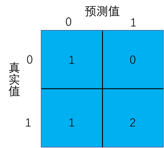

<script async src="//busuanzi.ibruce.info/busuanzi/2.3/busuanzi.pure.mini.js"></script>

<span id="busuanzi_container_site_pv" style="color:#829fbc;font-size:14px">本站总访问量 :eyes:<span id="busuanzi_value_site_pv"></span>次</span>




## 数据打乱

```python
x, y = sklearn.utils.shuffle(X, Y,random_state=1)
```

## 数据归一化

### 最大最小值归一化

```python
from sklearn.preprocessing import MinMaxScaler
data = [[-1, 2], [-0.5, 6], [0, 10], [1, 18]]
scaler = MinMaxScaler()
print(scaler.fit_transform(data))
```

## 混淆矩阵



